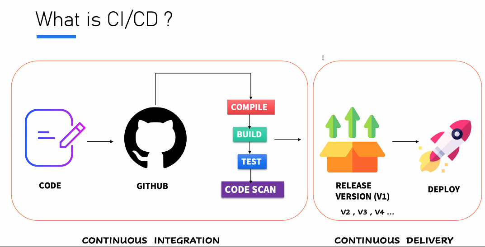

# 📚 Devops for Developers Notes - Java Techie #

## Index:
| No. | Session                                                       | Date         | Category |
|-----|---------------------------------------------------------------|--------------|----------|
| 1   | Basic Introduction and Getting Started with Jenkins           | 18 Feb, 2024 | Jenkins  |
| 2   | Jenkins Installation Guide for Windows and Mac                | 24 Feb, 2024 | Jenkins  |
| 3   | Jenkins CI/CD Flow with Example using Configuration Approach  | 25 Feb, 2024 | Jenkins  |


## ▶ Basic Introduction and Getting Started with Jenkins - ___18 Feb 2024___

### Simple flow (Manual approach) ###

- we write code -> store it in version control (GitHub) -> host in any cloud infrastructure- deploy the artifact (AWS, Azure, GCP)

- Before merging to GitHub, there should be pre-validation steps:
    - no compilation error
    - no build failure
    - no test failure
    - no major vulnerability

- We need to write script file and then deploy to cloud manually :(

- What if someone does the pre-validation task and deploy to cloud? Here comes Jenkins (We just need to instruct to Jenkins)

- Jenkins is an open-source automation server that facilitates the continuous integration and continuous delivery(CI/CD) of software. (automates ompilation, testing and deployment)

### Why Jenkins? (Problems before Jenkins) ###

- Manual Build and Deployment Processes
- Lack of Automated Testing (Unit tests, Integration tests)
- Inconsistency Across Environments(eg: version incompatibility in env)
- Deployment Challenges (deployment failure due to configuration mismatch)
- Poor Visibility and Monitoring (No tracking, no startup logs)

### What is CI/CD? ###

- Being a developer you only focus on development. Rest integration and deployment is taken care by Jenins

- Code -> GitHub -> (Compile->Build->Test->Code Scan)* -> Release(V1) -> Deploy

  *Will be taken care by Jenkins

> **Continuous Integration:** Code -> GitHub -> (Compile->Build->Test->Code Scan)</br> 
  **Continuous Delivery Deployment:** Release(V1) -> Deploy




## ▶ Jenkins Installation Guide for Windows and Mac - ___24 Feb 2024___

### Installation Guide: ###
https://medium.com/@javatechie/jenkins-installation-steps-in-windows-mac-os-fcdc34b930c3

### CI/CD: ###
```
	                    Jenkins pipeline
  	            ------------------------------------
 CODE -> GITHUB -> [CLEAN, BUILD, TEST, SCAN] -> DEPLOY
                    ------------------------     ------
                              CI                   CD
                    ------------------------------------
```

- We need to create a pipeline to perform the whole CI/CD we call it Jenkins pipeline
- Pipeline: To execute sequence of action (both CI and CD)


## ▶ Jenkins CI/CD Flow with Example using Configuration Approach - ___25 Feb 2024___

- In today's session, we will do CI/CD using the User Interface
- Code -> GitHub -> (Now we need someone to validate the code) -> Here comes Jenkins (it will pull the code from GitHub and it will compile, test, build) -> Generate WAR file -> Deploy to external tomcat server and push notification (additional feature)
- Steps till compile, test, build it comes under Continuous Integration
- Steps after that comes under Continuous Deployment (except push notification)
- The developer's responsibility is till GitHub, after that Jenkins will take the responsibility

### First Step: Continuous Integration using Jenkins: ###
1. Push the code to GitHub
2. Login to Jenkins and create a job/pipeline
3. Give a name and select Freestyle and click Ok
4. Give a description and go to Source Code Management
5. Select Git and paste the repository URL and go to Build Triggers
6. Select Poll SCM and in Schedule write: * * * * * (which means at every minute)
7. Select Build Environment (skip as of now)
8. Go to Build Steps and select "Invoke top-level Maven targets" since its a Maven project
9. In Goals use command: clean install
10. FYI We need to add Maven
11. Save
12. To add Maven:
    1. Go to Dashboard
    2. Go to Manage Jenkins and go to Tools
    3. Go to Maven installations and click Add Maven
    4. Now give a name and version and select Install Automatically
13. Click on Configure and now on the Build Steps, you will get Maven as option
14. Select the name you did on Manage jenkins's maven
15. Save
16. Click on Build now (You might have to change the branch to main instead of */master in configure) and it will build the maven project with "Build Success" message
17. With this CI flow is done

### Next Step: We need to generate the WAR and need to deploy the WAR to tomcat: ###
- To Start Tomcat server: Goto bin folder > execute startup.sh
- Tomcat runs on 8080 by default, to change it, open conf > server.xml and change the connector port to 9090

1. Go to localhost:9090/ to view the tomcat page
2. username password can be found on tomcat-users.xml for Manager App
3. Go to Jenkins Dashboard > Configure
4. Go to Post-build Actions
5. You won't find the tomcat option as we need to configure the plugin first
6. Go to Dashboard > Manage Jenkins
7. Select Plugins > Available Plugin > Search: Deploy to container Plugin and enable it
8. Now restart the Jenkins and go to configure
9. Now in the Post-build action you will find "Deploy war/ear to a container". Select that option
10. Write in WAR/EAR files: **/*war; Context path: jenkinsCiCd (same as WAR name); Add cointainer: Tomcat 9.x and select Username and password option:
       - add scope: Global; credentials: username: admin; password: admin; Tomcat URL: http://localhost:9090/
11. Save it
12. Click on "Build Now"
13. In the logs, you will find "Attempting to deploy 1 war file(s)"
14. Go to the Tomcat dashboard -> Manager App -> You will find /jenkinsCiCd

### To change the WAR file name generated by Jenkins: ###
1. In pom.xml, inside <build>, add another attribute <finalName>jenkinsCiCd</finalName>
2. Commit and push to remote repository (Ctrl+K)
3. Build will be automatically triggered in another minute
4. The new WAR file will have the jenkinsCiCd.war

``` 
Where do Jenkins store the war?
-> It stores in our local machine itself inside .jenkins folder
```

### How to enable notification in Jenkins: ###
1. Go to Jenkins dashboard and select your pipeline
2. Click configure
3. Add another Post build action and select E-mail Notification
4. Add recipient: <mail id>@gmail.com
5. Save
6. Now we need to tell Jenkins where our mail server is running:
7. Go to Dashboard > Manage Jenkins > System > Scroll to Email Notification
8. SMTP server: smtp.gmail.com; suffix: @gmail.com
9. Go to Advanced > Select Use SMTP Authentication username <your mail id>@gmail.com (from where the mail needs to be sent); password: add the app passcode
10. Select use SSL
11. SMTP Port: 465; Reply to address: <mail id>@gmail.com
12. Select Test configuration by sending test e-mail, and add an email
13. Save
14. Now for every failed build, it will trigger the mail (you can find in the console itself)