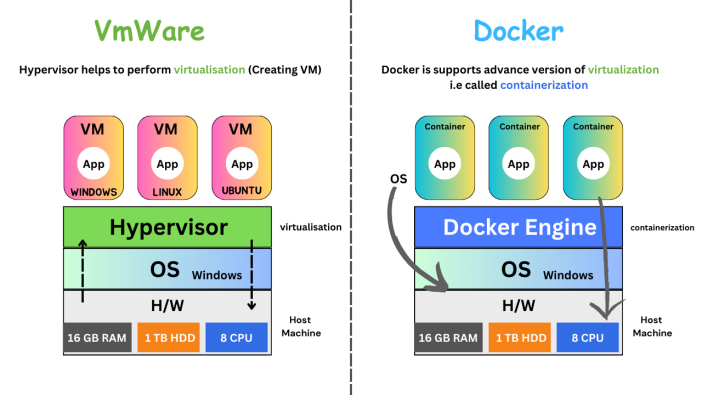

# 📚 Devops for Developers Notes - Java Techie #

## Index:
| No. | Session                                                                            | Date         | Category |
|-----|------------------------------------------------------------------------------------|--------------|----------|
| 1   | [Basic Introduction and Getting Started with Jenkins](#jenkins1)                   | 18 Feb, 2024 | Jenkins  |
| 2   | [Jenkins Installation Guide for Windows and Mac](#jenkins2)                        | 24 Feb, 2024 | Jenkins  |
| 3   | [Jenkins CI/CD Flow with Example using Configuration Approach](#jenkins3)          | 25 Feb, 2024 | Jenkins  |
| 4   | [Jenkins CI/CD Flow with Example using Declarative Approach](#jenkins4)            | 02 Mar, 2024 | Jenkins  |
| 5   | [Docker Introduction & getting started with Docker - Installation guide](#docker1) | 09 Mar, 2024 | Docker   |
| 6   | [Dockerize Spring Boot Application - Understand Workflow](#docker2)                | 16 Mar, 2024 | Docker   |
| 7   | [Dockerize Spring Boot Application using Google JIB](#docker3)                     | 17 Mar, 2024 | Docker   |
| 8   | [What is Docker Hub & How to push Docker image to Hub?](#docker4)                  | 23 Mar, 2024 | Docker   |
| 9   | [Jenkins CI/CD Build & Push Docker Images to Docker Hub](#jenkins5)                | 24 Mar, 2024 | Docker   |

<a name ="jenkins1"></a>
# ▶ Basic Introduction and Getting Started with Jenkins - ___18 Feb 2024___

### Simple flow (Manual approach)

- we write code -> store it in version control (GitHub) -> host in any cloud infrastructure- deploy the artifact (AWS, Azure, GCP)

- Before merging to GitHub, there should be pre-validation steps:
    - no compilation error
    - no build failure
    - no test failure
    - no major vulnerability

- We need to write script file and then deploy to cloud manually :(

- What if someone does the pre-validation task and deploy to cloud? Here comes Jenkins (We just need to instruct to Jenkins)

- Jenkins is an open-source automation server that facilitates the continuous integration and continuous delivery(CI/CD) of software. (automates ompilation, testing and deployment)

### Why Jenkins? (Problems before Jenkins)

- Manual Build and Deployment Processes
- Lack of Automated Testing (Unit tests, Integration tests)
- Inconsistency Across Environments(eg: version incompatibility in env)
- Deployment Challenges (deployment failure due to configuration mismatch)
- Poor Visibility and Monitoring (No tracking, no startup logs)

### What is CI/CD?

- Being a developer you only focus on development. Rest integration and deployment is taken care by Jenins

- Code -> GitHub -> (Compile->Build->Test->Code Scan)* -> Release(V1) -> Deploy

  *Will be taken care by Jenkins

> **Continuous Integration:** Code -> GitHub -> (Compile->Build->Test->Code Scan)</br> 
  **Continuous Delivery Deployment:** Release(V1) -> Deploy


<a name ="jenkins2"></a>
# ▶ Jenkins Installation Guide for Windows and Mac - ___24 Feb 2024___

### Installation Guide:
https://medium.com/@javatechie/jenkins-installation-steps-in-windows-mac-os-fcdc34b930c3

### CI/CD:
```
	                    Jenkins pipeline
  	            ------------------------------------
 CODE -> GITHUB -> [CLEAN, BUILD, TEST, SCAN] -> DEPLOY
                    ------------------------     ------
                              CI                   CD
                    ------------------------------------
```

- We need to create a pipeline to perform the whole CI/CD we call it Jenkins pipeline
- Pipeline: To execute sequence of action (both CI and CD)

<a name ="jenkins3"></a>
# ▶ Jenkins CI/CD Flow with Example using Configuration Approach - ___25 Feb 2024___

- In today's session, we will do CI/CD using the User Interface
- Code -> GitHub -> (Now we need someone to validate the code) -> Here comes Jenkins (it will pull the code from GitHub and it will compile, test, build) -> Generate WAR file -> Deploy to external tomcat server and push notification (additional feature)
- Steps till compile, test, build it comes under Continuous Integration
- Steps after that comes under Continuous Deployment (except push notification)
- The developer's responsibility is till GitHub, after that Jenkins will take the responsibility

### First Step: Continuous Integration using Jenkins:
1. Push the code to GitHub
2. Login to Jenkins and create a job/pipeline
3. Give a name and select Freestyle and click Ok
4. Give a description and go to Source Code Management
5. Select Git and paste the repository URL and go to Build Triggers
6. Select Poll SCM and in Schedule write: * * * * * (which means at every minute)
7. Select Build Environment (skip as of now)
8. Go to Build Steps and select "Invoke top-level Maven targets" since its a Maven project
9. In Goals use command: clean install
10. FYI We need to add Maven
11. Save
12. To add Maven:
    1. Go to Dashboard
    2. Go to Manage Jenkins and go to Tools
    3. Go to Maven installations and click Add Maven
    4. Now give a name and version and select Install Automatically
13. Click on Configure and now on the Build Steps, you will get Maven as option
14. Select the name you did on Manage jenkins's maven
15. Save
16. Click on Build now (You might have to change the branch to main instead of */master in configure) and it will build the maven project with "Build Success" message
17. With this CI flow is done

### Next Step: We need to generate the WAR and need to deploy the WAR to tomcat:
- To Start Tomcat server: Goto bin folder > execute startup.sh
- Tomcat runs on 8080 by default, to change it, open conf > server.xml and change the connector port to 9090

1. Go to localhost:9090/ to view the tomcat page
2. username password can be found on tomcat-users.xml for Manager App
3. Go to Jenkins Dashboard > Configure
4. Go to Post-build Actions
5. You won't find the tomcat option as we need to configure the plugin first
6. Go to Dashboard > Manage Jenkins
7. Select Plugins > Available Plugin > Search: Deploy to container Plugin and enable it
8. Now restart the Jenkins and go to configure
9. Now in the Post-build action you will find "Deploy war/ear to a container". Select that option
10. Write in WAR/EAR files: **/*war; Context path: jenkinsCiCd (same as WAR name); Add cointainer: Tomcat 9.x and select Username and password option:
       - add scope: Global; credentials: username: admin; password: admin; Tomcat URL: http://localhost:9090/
11. Save it
12. Click on "Build Now"
13. In the logs, you will find "Attempting to deploy 1 war file(s)"
14. Go to the Tomcat dashboard -> Manager App -> You will find /jenkinsCiCd

### To change the WAR file name generated by Jenkins:
1. In pom.xml, inside <build>, add another attribute <finalName>jenkinsCiCd</finalName>
2. Commit and push to remote repository (Ctrl+K)
3. Build will be automatically triggered in another minute
4. The new WAR file will have the jenkinsCiCd.war

``` 
Where do Jenkins store the war?
-> It stores in our local machine itself inside .jenkins folder
```

### How to enable notification in Jenkins:
1. Go to Jenkins dashboard and select your pipeline
2. Click configure
3. Add another Post build action and select E-mail Notification
4. Add recipient: <mail id>@gmail.com
5. Save
6. Now we need to tell Jenkins where our mail server is running:
7. Go to Dashboard > Manage Jenkins > System > Scroll to Email Notification
8. SMTP server: smtp.gmail.com; suffix: @gmail.com
9. Go to Advanced > Select Use SMTP Authentication username <your mail id>@gmail.com (from where the mail needs to be sent); password: add the app passcode
10. Select use SSL
11. SMTP Port: 465; Reply to address: <mail id>@gmail.com
12. Select Test configuration by sending test e-mail, and add an email
13. Save
14. Now for every failed build, it will trigger the mail (you can find in the console itself)

<a name ="jenkins4"></a>
# ▶ Jenkins CI/CD Flow with Example using Declarative Approach - ___02 Mar 2024___

1. Last class we saw how to use UI to automate CI & CD
2. Declarative approach is the best practice using script to automate the CI & CD
3. Create new pipeline > jenkins-second-demo > select Pipeline > OK
4. Now we will get only three option: General, Advanced Options, Pipeline
5. Go to Build Trigger: Select Poll SCM: * * * * * (every minute)
6. We won't get build step or post build step as we wil be using script
7. Go to Pipeline: Definition: Pipeline script, Select: GitHub + Maven
8. Script uses Groovy (no prior knowledge required)
9. Stages: group of action ; Stage: action

eg: 
```
// stage 1: scm checkout
// stage 2: build (till here CI)
// stage 3: deploy WAR (CD)
// stage 4: email (not a part of CI CD)
```
```
pipeline{

    agent any
    tools{
        maven "maven"
    }
    stages{

        stage("SCM checkout"){
            steps{
                checkout scmGit(branches: [[name: '/main']], extensions: [], userRemoteConfigs: [[url: 'https://github.com/javatechie-devops/jenkins-ci-cd.git']])
            }
        }

        stage("Build Process"){
            steps{
                script{
                    sh 'mvn clean install'
                }
            }
        }

        stage("Deploy to Container"){
            steps{
                deploy adapters: [tomcat9(credentialsId: 'tomcat-pwd', path: '', url: 'http://localhost:9090/')], contextPath: 'jenkinsCiCd', war: '**/.war'
            }
        }

    }

    post{
        always{
            emailext attachLog: true, 
            body: ''' <html>
                        <body>
                            <p>Build Status: ${BUILD_STATUS}</p>
                            <p>Build Number: ${BUILD_NUMBER}</p>
                            <p>Check the <a href="${BUILD_URL}">console output</a>.</p>
                        </body>
                      </html>''', 
            mimeType: 'text/html', 
            replyTo: 'javatechie.learning@gmail.com', 
            subject: 'Pipeline Status : ${BUILD_NUMBER}', 
            to: 'javatechie.learning@gmail.com'

        }
    }
}
```

### You can click Pipeline Syntax for help in groovy:
- Select checkout from version control > give details > Generate Pipeline script > Copy the code generated 
- Select Deploy war/ear to container > WAR/EAR: **/*.war ; Context path: jenkinsCiCd; Credentials : admin/**** ; Tomcat URL: http://localhost:9090 > Generate the pipeline script > Copy the code generated
- Same process can be done for email as well

10. Save it
11. Build will start automatically
12. We need to not define a separate stage for Notification as it doesn't come under CI/CD (it will come in Post)
```
To send a email for every build:
System > Extended Email Notification > Select always from a drop down menu
```

###  In general practice, we don't write the groovy script from the Jenkins. We attach the script with the code itself (filename: JenkinsFile)
1. Create jenkins-third-demo
2. Select Pipeline project and select OK
3. Select Pipeline script from SCM

<a name ="docker1"></a>
# ▶ Docker Introduction & getting started with Docker | Installation guide - ___09 Mar 2024___

- According to docker.com: Docker helps developers build, share, run, and verify applications anywhere — without tedious environment configuration or management.
- Docker helps to build, run, deploy and verify your code

### Why do we need Docker?

```Check the diagrams under class notes directory (Docker_x_9-mar)```

#### Example 1:

For creating e-commerce application we need:
1. Java 8
2. Spring Boot 3.x
3. MongoDB 4.x
4. Angular 8
5. Kafka 2.7

Now if someone asks for the code, one needs to push the code to GitHub. However, another developer might not be able to run the application as the other developer might not have the required dependency or incompatible
(Java 8, Kafka, etc.)

**Solution:** What if we package all the dependencies and share to others. This packaging is the solution. Docker will do this packaging.
So Docker will take all the dependencies and it will create an image. The other developer can take the image and clone it and run it

#### Example 2:

- A team of three people are developing the same ecommerce application with the same dependencies as above in year 2021
- Now we need to deploy the application to a server, 
- So we purchased a server after 3 years
- Now, if I deploy the application after 3 years, will the application work?
- The server might have Kafka 3.x version, etc. (dependency version mismatch or Jar conflict corrupted)

**Solution:** Docker can package the entire application, i.e., it will create an image. When I deploy in the future, I will have all the required dependencies. (Even if the server does not have anything installed)

#### Example 3:

- Let's suppose a developer has created an application with MySQL8, and it went to testing
- When code went to a testing team, they are using MySQL5. 
- Will the code work in testing? Maybe or maybe not

Why can't we run the application in an isolation manner? I.e., wherever we go the application runs
If what dependency the dev is using, the same dependency testing team is using

**Possible solution:** I can share my OS and pieces of software and my application so that my application runs in all environment
But we can't share my operating system to someone else

**Solution using Docker:** I will create an image, and I will share the image to the testing team

### How were things used before Docker?

- Server needs to be purchased with some configuration (RAM, HDD, CPU)
- Initially the load was less, but later the traffic increased in where the present server will be unable to run the application
- Now they will buy another server
- After sometime, **VMWare** was launched. It provided a mechanism called VMWare Work Station which can allow to run multiple OS is a single server
- How VMWare Work Station works? Above the OS layer, it added another layer called "Hypervisor". This Hypervisor helps to create Virtual Machine (Virtualization). Now we can create different VMs. We can install OS on the VMs.
- While creating these VMs, we need to assign configuration (e.g.: RAM) from the local machine
- If the RAM is used up by VMs. we can't create another VM if no memory is left in local
- Also, these VMs use their own OS (We need to take license)
- Hypervisor will take the resources from local machine and distribute to VMs

So the problem with this approach:
- Resource is limited
- Fixed memory size and not re-usable
- Mandatory installation of OS

To overcome these issues, here comes DOCKER
- Docker is an advanced version of the above virtualization knows as Containerization
- The configuration is almost the same as VMWare, but above our OS, instead of Hypervisor we have "Docker Engine"
- Above Docker Engine, instead of VMs, we have Containers
- We can deploy our apps here
- To run any application, we need an operating system, so Docker will take help of the local Operating System.
- Also, docker doesn't allocate memory to a container for a long time. Once done, docker will release the memory
- These local machines are called Host Machine



Installation guide: https://medium.com/@javatechie/docker-installation-steps-in-windows-mac-os-b749fdddf73a

<a name ="docker2"></a>
# ▶ Dockerize Spring Boot Application - Understand Workflow - ___16 Mar 2024___

### Dockerize your application steps


Example:
1. I have a java application
2. To run java application, we need JDK (for compiling and running)
3. To run JAR we need command: ```java -jar app.jar```

- Can I instruct these informations to Docker? Yes, using Dockerfile
- Using the Dockerfile it will create the image and using container, we can run it

> Dockerfile is a simple file that contains instruction about your application. eg: How you will run your application?, What dependencies needed to run your application?

### 1. Run a Simple Spring Boot Application using Docker
1. Create a new Spring Boot project: spring-docker with dependency: spring-web
2. Create an endpoint with Get Mapping
3. Change the server.port=8282
4. Build the application
5. Now I want this application to be dockerize
6. Create file: Dockerfile

```
FROM openjdk:17
WORKDIR /appContainer    // It wil craete a directory on the container (optional). Else, all things will be stored in root directory
COPY ./target/spring-docker.jar /appContainer
EXPOSE 8282 			 // which port in container will the aplication run (keep it same as server.port)
CMD ["java", "-jar", "spring-docker.jar"]
```
7. Start the docker engine (docker desktop)
8. In the root directory, cmd: ```docker build -t spring-docker-app:1.0 .```. It will create an Image
9. To verify, cmd: ```docker images```
10. To run this particular docker image in docker container, cmd : ```docker run -d -p 9090:8282 spring-docker-app:1.0```. 9090 is the localhost, 8282 is the container port.
11. To verify if the container started or not: ```docker ps```

12. To see logs: ```docker logs <container id>```
13. To execute bash command: ```docker exec -it <container id> /bin/bash```
14. Now you can nevigate to the directory
14. Now you can give a request to http://localhost:9090/greetings

### 2. To use apps like kafka (or any third party library), we will be needing certificates: (01:05)
- If my application is running on the container, my container must have those certificates with him
1. Create a cert.txt in the root directory of the application
2. Do these changes in the Dockerfile:
```
FROM openjdk:17
WORKDIR /appContainer
COPY cert.txt /appContainer/cert.txt
COPY ./target/spring-docker.jar /appContainer
EXPOSE 8282 
CMD ["java", "-jar", "spring-docker.jar"]
```

To create a new image:
1. build the application again (mvn clean install)
2. Create an image: ```docker build -t spring-docker-app:2.0 .```
3. To verify: ```docker images```
4. To run: ```docker run -d -p 7070:8282 spring-docker-app:2.0```
5. Use cmd: ```docker ps``` to confirm the container running
6. Use cmd: ```docker exec -it 3a00ffd8779e /bin/bash``` to see the cert.txt present or not
7. To see the logs: ```docker logs 3a00ffd8779e```

### 3. Using Docker Commit
- Now let's suppose we have to do some experiments in the container itself, but I don't want it to break. After doing the experiment, I don't want to touch the existing container, instead I want a new version with the new experiment changes. Basically, we modify a container and crearte another version of it.
- app 2.0 ------> do experiments (success): patch file for PUBG game -------> app 3.0

1. Add experimental changes in the code
2. build jar
3. create image
4. run a new container

Rather doing the above steps, docker can create a clone of the existing image as seperate image: Using docker commit

### Steps:
1. Go to the spring-docker-app:2.0
2. Open bash command: ```docker exec -it 3a00ffd8779e /bin/bash```
3. Do some changes: ```echo "index.hyml">index.html```
4. You can find the new file in the appContainer directory of spring-docker-app:2.0
5. But I don't want this new file to be there on the 2.0 container, rather I want to create a new container and clone this new change
6. Use cmd: ```docker commit <2.0 container id> spring-docker-app:3.0```
7. Use cmd: ```docker images``` to see a new 3.0 version of the application
8. To stop the running container: ```docker stop 3a00ffd8779e```
9. Now run the new docker image: ```docker run -d -p 9191:8282 spring-docker-app:3.0```
10. Run the 2.0 app again: ```docker run -d -p 7070:8282 spring-docker-app:2.0```
11. Now you won't be able to find the index.html on the 2.0 but will be there in the 3.0

*Docker Commands:* https://github.com/basanta-spring-boot/documents/blob/main/docker-README.md

### Assignment:
Write a shell script/batch file which will create a folder called "logmon" in container on application startup and write all your application logs to that "logmon/application.log"

<a name ="docker3"></a>
# ▶ Dockerize Spring Boot Application using Google JIB - ___17 Mar 2024___

- Google Cloud team designed a plugin for Java application: Google JIB
- It will help us create Docker Image without us taking extra effort of writing Dockerfile, or instructing the information to Docker or without starting the Docker daemon
- Jib handles all steps of packaging your application into a container image. You don't need to know best practicEs for creating Dockerfiles or have Docker installed.


### Two different approaches to dockerize our application without using Dockerfile:
1. Google JIB
2. Cloud Native BuildPack (Spring Boot 2.3.x onwards)
   We will understand these two approach. These two are helpful in quick testing, but not recommedned beyond Dev environment.

### 1. Google JIB
Will show how using Google JIB:
Create Image -> Run the container with that particular image

#### Steps:
1. We need to add the Google JIB dependency (Firstly remove the Dockerfile):
2. Add this plugin in the pom.xml:
```
<plugin>
	<groupId>com.google.cloud.tools</groupId>
	<artifactId>jib-maven-plugin</artifactId>
	<version>3.2.1</version>
	<configuration>
		<to>spring-docker:5.0</to>
	</configuration>
</plugin>
```
3. Check ```mvn -v```
4. ```mvn compile jib:dockerBuild``` (Make sure Docker Desktop is running, it is required initialy as we are not pushing to any registry)
   (22:46
5. Go to bash, and go to app/lib, you will find all the dependencies (28:33)

### 2. Cloud Native BuildPack
- Buildpack is something like magic box, that can figure out what kind of application you have, and it builds a container for you without looking at Dockerfile

#### Steps:
1. Comment the plugin added in the previous step, and do a mvn clean
2. Now cmd: ```mvn spring-boot:build-image```
3. It will create an image with tag name: 0.0.1-SNAPSHOT
4. Now run the image: ```docker run -d -p 9191:8282 spring-docker-practice:0.0.1-SNAPSHOT```
5. To give a customized name: ```mvn spring-boot:build-image -Dspring-boot.build-image.imageName=spring-docker-app:v2```

<a name ="docker4"></a>
# ▶ What is Docker Hub & How to push Docker image to Hub? - ___23 Mar 2024___
- Where Can i store Docker Image from where everyone can access? -> Docker Hub, AWS ECR, GitHub
- **Docker Hub** is a registry to store your docker images

### Steps to push images to Docker Hub:
1. Create a Docker Hub account (sign up): https://hub.docker.com/
2. Create Docker image*
3. Then you can push your images to Docker hub
4. Login to Docker Hub from cmd prompt: `docker login`
5. Give the username and password when prompted (It will create a file called config.json, it will wrap this username and password and create one secret token)
6. Tag your image with your username, cmd: `docker tag spring-docker-app:1.0 javatechie4u/spring-docker-app:1.0`
7. Now when you do `docker images`, you can find another image with your image tagged
8. Push image to Docker Hub: `docker push javatechie4u/spring-docker-app:1.0`
9. Go to your Docker Hub -> Repositories: You can find the image here

### Steps to pull images from Docker Hub:
1. You can find the cmd to pull the image: `docker pull javatechie4u/spring-docker-app`
2. To pull the image: use the cmd: `docker pull javatechie4u/spring-docker-app:1.0`
3. You can find the image in `docker images` cmd
4. To run, cmd: `docker run -d -p 9090:8282 javatechie4u/spring-docker-app:1.0`
5. Send request to `localhost:9090` and you can see the application is running.

*Steps to create Docker image:
1. Create Dockerfile
2. Build JAR: `mvn clean install`
3. build docker images: `docker build -t spring-docker-app:1.0 .`

* To use MongoDB, we can use Docker Hub to pull the image: **bitnami/mongodb** -> `docker pull bitnami/mongodb`
* To use Kafka, we can use Docker Hub to pull the image: **bitnami/kafka** -> `docker pull bitnami/kafka`
* To use MySQL, we can use Docker Hub to pull the image: **mysql** -> `docker pull mysql`

### Commands used today:
```
docker login

docker tag spring-docker:1.0 javatechie/spring-docker:1.0

docker push javatechie/spring-docker:1.0

docker pull javatechie/spring-docker:1.0
```

### Next class will be:
    * Earlier:
      * **CI:** BUILD, TEST, GENERATE WAR
      * **CD:** Deploy WAR to Tomcat

    * From now on:
      * **CI:** BUILD, TEST, Build docker image
      * **CD:** Docker login, tag image, Push/Deploy image to Hub

<a name ="jenkins5"></a>
# ▶ Jenkins CI/CD Build & Push Docker Images to Docker Hub - ___24 Mar 2024___

* Earlier: code -> GitHub -> Jenkins (CI) [Compile -> Test ->Build] -> (CD)Generate WAR -> Deploy to Tomcat -> Send email
* In real time, we need to play with containerization:
  code -> GitHub -> Jenkins (CI) [Compile -> Test -> Build] -> (CD)Create Docker Image -> Push that image to Docker Hub -> receive mail notification
  

### For CD flow we need to:
1. Create Dockerfile
2. Build Docker image using command (using Docker build)
3. Push Docker image to DockerHub :Docker login, Tag your image & push

#### Steps:
1. Create Dockerfile
```
FROM openjdk:17
WORKDIR /appContainer
COPY target/jenkinsCiCd.jar /appContainer
EXPOSE 8282
CMD ["java", "-jar", "jenkinsCiCd.jar"]
```

2. Do mvn clean install (In target, you can find the jar file)
3. Login to Jenkins: Go to the groovy script.
4. CI steps will remain same as before: SCM checkout and Build Process
5. Remove step: Deploy to container (which deploy to the tomcat server)
6. We just need to configure the CD part
7. Replace "Deploy to container" step with:
```
stage("Build Docker Image"){
            steps{
                script{
                    bat 'docker build -t attrayadas/spring-cicd-docker:1.0 .'
                }
            }
        }
```

4. Jenkins needs some plugin: Dashboard > Manage Jenkins > Plugins > Available Plugins > Search for "Docker" > Select *Docker, Docker Commons, Docker Pipeline, Docker API, docker-build-step, CloudBees Docker Build and Publish* and install them
5. Select *Restart Jenkins when installation is complete and no jobs are running*
6. Commit the changes (adding Dockerfile) to GitHub and Build it using Jenkins
```
pipeline {
    agent any
    tools{
        maven "maven"
    }
    stages{
        stage("SCM checkout"){
            steps{
                checkout scmGit(branches: [[name: '*/master']], extensions: [], userRemoteConfigs: [[url: 'https://github.com/attrayadas/jenkins-ci-cd-demo.git']])
            }
        }

        stage("Build Process"){
            steps{
                script{
                    bat 'mvn clean install'
                }
            }
        }
        stage("Build Docker Image"){
            steps{
                script{
                    bat 'docker build -t attrayadas/spring-cicd-docker:1.0 .'
                }
            }
        }
    }
}
```
7. You will find the docker image in the Docker Desktop
8. Now let's push to Docker Hub.
9. Add another step: Push to DockerHub and click on *Pipeline Syntax*
10. Select *withCredentials: Bind credentials to variables* > Select *Secret text* in Bindings option > Add name in variable "docker-credentials" > Add credentials - Jenkins > Select Kind - Secret text > Now need to add password in *Secret* (You can add token also from Docker Desktop) > *Generate Pipeline Script* >
11. The new stage to push the image to DockerHub would be:
```
stage("Deploy Image to DockerHub"){
            steps{
                withCredentials([string(credentialsId: 'docker-credential', variable: 'docker-credential')]) {
                    bat 'docker login -u attrayadas -p {%docker-credential}'
                    bat 'docker push attrayadas/spring-cicd-docker:1.0'
                }   
            }
        }
```
12. Now, you will find the image in the Docker Hub

### But now, everytime we push some changes, new docker images will be created using version 2.0. But we need to make it dynamic
#### We have to define the environment:
1. In the script, add these environments:
```
 environment{
            APP_NAME = "spring-docker-cicd"
            RELEASE_NO = "1.0.0"
            DOCKER_USER = "attrayadas"
            IMAGE_NAME = "${DOCKR_USER}"+"/"+"${APP_NAME}"
            IMAGE_TAG = "${RELEASE_NO}-${BUILD_NUMBER}"  // Build number is inbuilt
        }
```
2. Now we need to change the respective stages:
```
 stage("Build Docker Image"){
            steps{
                script{
                    bat "docker build -t ${IMAGE_NAME}:${IMAGE_TAG} ."
                }
            }
        }
        stage("Deploy Image to DockerHub"){
            steps{
                withCredentials([string(credentialsId: 'docker-password', variable: 'docker-password')]) {
                    bat 'docker login -u attrayadas -p ${docker-password}'
                    bat "docker push ${IMAGE_NAME}:${IMAGE_TAG}"
                }   
            }
        }
```
3. Build it now


### Full Script from the class:
```
pipeline{

    agent any
    tools{
        maven "maven"
    }

    environment{
           APP_NAME = "spring-docker-cicd"
           RELEASE_NO= "1.0.0"
           DOCKER_USER= "javatechie4u"
           IMAGE_NAME= "${DOCKER_USER}"+"/"+"${APP_NAME}"
           IMAGE_TAG= "${RELEASE_NO}-${BUILD_NUMBER}"
    }

    stages{

        stage("SCM checkout"){
            steps{
                checkout scmGit(branches: [[name: '*/main']], extensions: [], userRemoteConfigs: [[url: 'https://github.com/javatechie-devops/jenkins-ci-cd.git']])
            }
        }

        stage("Build Process"){
            steps{
                script{
                    sh 'mvn clean install'
                }
            }
        }

        stage("Build Image"){
            steps{
                script{
                    sh 'docker build -t ${IMAGE_NAME}:${IMAGE_TAG} .'
                }
            }
        }

        stage("Deploy Image to Hub"){
            steps{
                withCredentials([string(credentialsId: 'dp', variable: 'dp')]) {
                 sh 'docker login -u javatechie4u -p ${dp}'
                 sh 'docker push ${IMAGE_NAME}:${IMAGE_TAG}'
                }
            }
        }


    }

    post{
        always{
            emailext attachLog: true,
            body: ''' <html>
    <body>
        <p>Build Status: ${BUILD_STATUS}</p>
        <p>Build Number: ${BUILD_NUMBER}</p>
        <p>Check the <a href="${BUILD_URL}">console output</a>.</p>
    </body>
</html>''', mimeType: 'text/html', replyTo: 'javatechie.learning@gmail.com', subject: 'Pipeline Status : ${BUILD_NUMBER}', to: 'javatechie.learning@gmail.com'

        }
    }
}
```